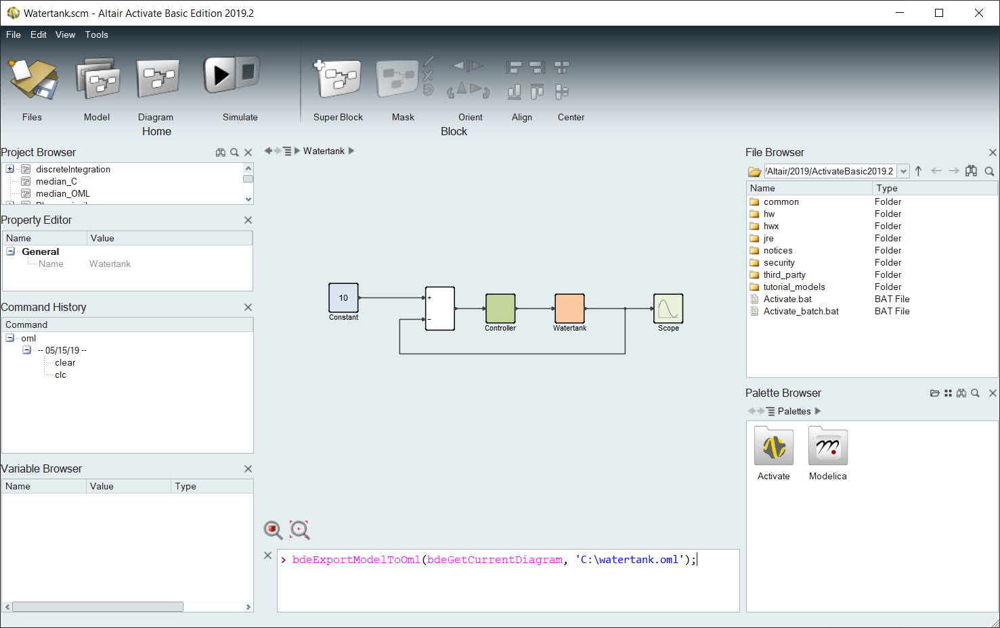

# ActPort Conversion Process Overview

## Export Activate model to OML

OML is the programming language of Activate. Starting in Activate 2019.2 it is possible to export a model to an 
OML-program which can generate the model using the Activate API.

To export the model, just use
```matlab
bdeExportModelToOml(bdeGetCurrentDiagram, <path>);
```
as shown in this figure:


## Processing the OML-file

The resulting [OML-file](../src/test/resources/examples/Watertank.oml) 
contains calls to the Activate API. If the instructions in the file are executed in Activate the same model should be 
created again.

Since OML is syntactically compatible with Matlab we should theoretically be able to execute the OML-file in
Matlab. This is, however, not possible without some pre-processing of the script. Matlab m-files can be written in two 
styles: scripts and functions. Since Matlab 2016b it is possible to 
[include functions in a script](https://se.mathworks.com/help/matlab/matlab_prog/local-functions-in-scripts.html)
as long as the functions are located last in the file.

The generated OML-file contains all functions first and the script last. This means that we have to move 
[the script](../src/test/resources/examples/Watertank.oml#L486-L493)
before the functions.

The Activate API has a function called `add_block` which is also present in Simulink. In order to avoid shadowing
the original `add_block` we rename the function to `add_block_2`.

## Running the OML-file

To be able to run the OML-file in Matlab we need to implement the functions and have them do something meaningful.
Since Java is deeply integrated into Matlab it is possible to create Java functions which are indistinguishable from
Matlab functions. Because Matlab is lacking powerful data collections out of the box [Scala](https://scala-lang.org/)
is used to implement the Activate API. The Scala code cannot hold any state which means that all of the functions
must be [pure](https://en.wikipedia.org/wiki/Pure_function).

Before the modified OML-file is executed in every function in Matlab calling the Activate API must import the functions
from the jar-file. After this has been done the OML-file can be run in Matlab.

All of this is done by [calling `import_activate_oml`](../src/main/matlab/import_activate_oml.m).

The strategy is to let the 
[implemented Activate API](../src/main/scala/actport/oml/Matlab.scala) 
build a data structure using powerful immutable collections of 
Scala. All generated OML-scripts end by 
[calling `evaluate_model`](../src/test/resources/examples/Watertank.oml#L492) 
which is used as a hook for transforming the collected data of the model, transforming the model to fit
Simulink and then instantiate blocks and links in a new Simulink model.

##  Evaluating the model

When `evaluate_model` is [called](../src/main/matlab/evaluate_model.m)
the first thing which happens is to convert the parsed data structure generated by the OML-script into a 
[cleaner structure](../src/main/scala/actport/model/Model.scala#L9-L12)
consisting of a set of blocks, links, port maps and solver settings. The port maps translate which Activate port
corresponds to which Simulink port if there are any differences.

The model goes through a set of transformations where fundamental differences between Activate and Simulink
are handled. Branched links are, for example, represented as blocks in Activate while they are separate links
in Simulink. A transformation modifies the model on a level where several blocks and links are involved at the same
time.

Functions which generate Simulink blocks are collected in a library. If a block does not have a corresponding
function in its library an empty subsystem with ports is created. The block functions can modify the model
through some functions where ports are mapped or marked as illegal to connect to. This way, each block can
decide for themselves what their port configuration should be like.

After all blocks have been added another set of transformations take place where links are processed based on
the updated model state. Any link connected to an illegal port is removed.

Links are added and all ports are updated with respect to the port map of the model.

Finally, the model is automatically rearranged by Simulink, model parameters are set (solvers, tolerances, etc.) and
the model is saved to disk.
